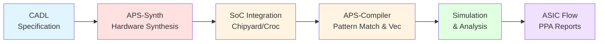

# APS has undergone significant evolution and is now integrated with MLIR. For the latest version and ongoing development, please visit our new repository: [aps-mlir](https://github.com/pku-liang/aps-mlir)

# APS: Agile Processor Synthesis

<div align="center">

[](https://iccad.com/)
[](https://www.linux.org/)

**An Open-Source Hardware-Software Co-Design Framework for Agile Processor Specialization**

[Getting Started](#getting-started) •
[Documentation](#usage) •
[Examples](#quick-start-example)

</div>

---

## Citation

If you use APS in your research, please cite our ICCAD'25 paper:

```bibtex
@inproceedings{xiao2025aps,
  title={APS: Open-Source Hardware-Software Co-Design Framework for Agile Processor Specialization},
  author={Xiao, Youwei and Zou, Yuyang and Xu, Yansong and Luo, Yuhao and
          Sun, Yitian and Yin, Chenyun and Xu, Ruifan and Chen, Renze and Liang, Yun},
  booktitle={2025 IEEE/ACM International Conference on Computer-Aided Design (ICCAD)},
  year={2025},
  organization={IEEE}
}
```

---

## Overview

**APS (Agile Processor Synthesis)** is an end-to-end open-source framework for rapid hardware-software co-design of domain-specific RISC-V processors. APS enables researchers and developers to design, synthesize, compile, simulate, and physically implement custom instruction set extensions with minimal effort.

### Key Features

- **Cross-Level Architecture Description Language (CADL)**: High-level specification of custom instructions with automatic hardware generation
- **Unified Instruction Extension Interface (APS-Itfc)**: Seamless portability across RISC-V platforms (RoCC and CV-X-IF)
- **Hardware Synthesis (APS-Synth)**: Automatic translation from CADL to optimized RTL with dynamic pipeline architecture
- **Compiler Infrastructure (APS-Compiler)**: Pattern matching and bitwidth-aware vectorization for transparent instruction utilization
- **Complete Flow**: From specification to physical design with comprehensive evaluation reports

### Framework Components



APS consists of two core tools that work together:

- **APS-Synth**: Translates CADL (Cross-level Architecture Description Language) specifications into optimized SystemVerilog RTL with dynamic pipeline architecture. Handles instruction scheduling, resource allocation, and generates the unified APS-Itfc interface for seamless SoC integration.

- **APSC**: An LLVM-based compiler infrastructure that automatically utilizes custom instructions in C/C++ code. Features semantic-based pattern matching to identify instruction opportunities and bitwidth-aware vectorization to pack sub-word operands, maximizing instruction efficiency.

## Getting Started

### Prerequisites

- **OS**: Linux (tested on Ubuntu 20.04+)
- **Package Manager**: [Pixi](https://pixi.sh/latest/) (for dependency management)
- **Disk Space**: ~50GB for complete environment

### Installation

1. **Clone the repository**
   ```bash
   git clone https://github.com/pku-liang/aps.git
   cd aps
   ```

2. **Initialize the APS environment**
   ```bash
   pixi run build
   ```

   This will:
   - Install all required dependencies (Verilator, CIRCT, RISC-V toolchain, etc.)
   - Build the necessary SoC environments (Chipyard/Croc)
   - Set up the compiler infrastructure

   **Note**: Initial setup may take 30-60 minutes depending on your system.

3. **Install VSCode Extension (Optional but Recommended)**

   APS provides a VSCode extension for enhanced development experience:
   
   In VSCode:
   - Open VSCode
   - Go to Extensions (Ctrl+Shift+X)
   - Click the "..." menu → "Install from VSIX..."
   - Select `vscode-plugin/*.vsix`

   The extension provides graphical buttons for all APS operations and automatic file organization.

---

## Quick Start Example

Let's walk through a complete example using the NTT (Number Theoretic Transform) accelerator for post-quantum cryptography.

### Demo Video

https://github.com/user-attachments/assets/99f8faa9-e7a2-49d2-90c2-e4275eaf6900

The video walks through the same steps described below, demonstrating the complete workflow from configuration to performance analysis.

---

> **Note**: APS provides a VSCode extension for easier workflow management. You can use either the command-line interface (shown below) or the VSCode extension (described in each step).

### Step 1: Create Project Configuration

APS provides several pre-configured examples in `workspace/configs/`. For this tutorial, we'll use the NTT (Number Theoretic Transform) example for Chipyard/RoCC platform (`ntt_rocket.yml`).

**Using VSCode Extension:**
1. Click **"APS Init"** in the VSCode sidebar
2. Select your APS environment path (current directory by default)

You can also create your own configuration file in `workspace/configs/`:

```yaml
general:
  proj: "ntt"
  cadl: "ntt.cadl"
  c_file: "ntt.c"
  c_func_eval: "pure_ntt"
  platform: "rocc"  # or "croc" for CV-X-IF backend

synthesis:
  target-period: 6.0  # 166.7MHz target frequency

compile:
  optimization_level: "O3"

simulation:
  dump_vcd: true
  compare_golden: true

asic:
  pdk: "sg13g2"
  target-period: 6.0
```

### Step 2: Initialize Project Workspace

**Using Command Line:**
```bash
# Generate project structure from the ntt_rocket configuration
pixi run project ntt_rocket
```

**Using VSCode Extension:**
1. Click **"Project Init"** in the VSCode sidebar
2. Select the configuration file: `workspace/configs/ntt_rocket.yml`
3. The project workspace will be automatically created

This creates the following structure in `workspace/ntt_rocket/`:
```
workspace/ntt_rocket/
├── cadl/           # CADL instruction specifications
│   └── ntt.cadl    # (empty, ready for your specs)
├── csrc/           # C application code
│   └── ntt.c       # (empty, ready for your code)
├── Makefile        # Auto-generated build configuration
├── out/            # Generated outputs (RTL, binaries, etc.)
└── report/         # Analysis reports
```

### Step 3: Define Custom Instructions (CADL)

Edit `workspace/ntt_rocket/cadl/ntt.cadl` to specify your custom instructions:

```rust
// Example: Butterfly operation for NTT
#[opcode(7'b0101011)]
#[funct7(7'b0000000)]
rtype bf_radix2_parallel(rs1: u5, rs2: u5, rd: u5) {
    // Load operands from memory
    let x_l_addr:u32 = addr_base + point_index_u32;
    let x_h_addr:u32 = x_l_addr + point_stride_u32;
    let x_l:u32 = _mem[x_l_addr];
    let x_h:u32 = _mem[x_h_addr];

    // Perform butterfly computation
    let bf_result_l: u24 = bf_op(rotation_factor_0, x_l_0, x_h_0);
    let bf_result_h: u24 = bf_op(rotation_factor_0, x_l_1, x_h_1);

    // Store results
    _mem[x_l_addr_o] = result_l;
    _mem[x_h_addr_o] = result_h;
}
```

### Step 4: Write Application Code (C)

Edit `workspace/ntt_rocket/csrc/ntt.c` with your application:

```c
#include <stdint.h>

void pure_ntt(volatile uint16_t *a) {
    uint32_t t = 256;
    for (uint32_t m = 1; m < 128; m <<= 1) {
        t >>= 1;
        for (uint32_t i = 0; i < m; i++) {
            uint32_t j1 = (i << 1) * t;
            uint16_t s = PRE_COMPUT_TABLE_NTT[m + i];
            for (uint32_t j = j1; j < j1 + t; j++) {
                // This loop will be automatically optimized
                // by APS compiler to use custom instructions
                uint32_t ys = (a[j + t] * s) % 3329;
                a[j + t] = (a[j] + 3329 - ys) % 3329;
                a[j] = (a[j] + ys) % 3329;
            }
        }
    }
}
```

### Step 5: Run the Complete Flow

**Using Command Line:**
```bash
# Run individual stages using pixi
pixi run synth ntt_rocket      # Hardware synthesis (CADL → RTL)
pixi run compile ntt_rocket    # Software compilation with custom instructions
pixi run sim ntt_rocket        # RTL simulation and performance analysis

# Or run the complete end-to-end flow
pixi run build-all ntt_rocket
```

**Using VSCode Extension:**

The VSCode extension provides convenient buttons in the Build Commands panel:
- **All**: Run the complete end-to-end flow
- **Synthesis**: Generate hardware from CADL specifications
- **Compile**: Compile C code with custom instruction optimizations
- **Simulate**: Run RTL simulation and generate performance reports
- **ASIC**: Run physical design flow
- **Clean**: Clean all generated outputs

As each stage completes, generated files will be displayed in the **File Explorer** panel (left bottom) for easy access to outputs and reports.

### Step 6: View Results

After completion, APS generates comprehensive reports in `workspace/ntt_rocket/report/`:

**Synthesis Reports** (`report/synth/`):
- `summary.md` - Hardware synthesis summary including lines of code comparison between CADL and generated SystemVerilog, showing productivity gains
- Scheduling logs and intermediate representations for each instruction

**Compiler Reports** (`report/compile/`):
- `ntt_patmatch.rpt` - Pattern matching report showing where custom instructions replaced original C code
- `ntt_vec.rpt` - Vectorization report detailing how the instruction further mapped to a vectorized ISAX.

**Simulation Reports** (`report/sim/`):
- `ntt_compare.rpt` - Performance comparison showing baseline vs. ISAX-enabled cycle counts and speedup
- `ntt_combined.html` - Interactive HTML report with visualization of all stages (CADL, C source, LLVM IR, Verilog, execution traces)
- Individual trace files and waveforms for detailed analysis

**ASIC Reports** (`report/asic/`):
- Logic synthesis reports with area breakdown
- Physical implementation reports with PPA (Power, Performance, Area) metrics
- Final timing, area, and power analysis

---

## Usage

### Project Management

```bash
# Initialize APS environment
pixi shell -e aps

# Create a new project from provided configurations
pixi run project <config_name>

# Available example configurations:
pixi run project ntt_rocket      # NTT for post-quantum crypto (Chipyard/RoCC)
pixi run project ntt_croc        # NTT for post-quantum crypto (PULP/CV-X-IF)
pixi run project bitnet_rocket   # BitNet for ML inference (Chipyard/RoCC)
pixi run project bitnet_croc     # BitNet for ML inference (PULP/CV-X-IF)
pixi run project iir_rocket      # IIR filter for DSP (Chipyard/RoCC)
pixi run project mulsh4_rocket   # MULSH4 example (Chipyard/RoCC)
```

### Build Commands

```bash
# Complete end-to-end flow
pixi run build-all <config_name>

# Individual build stages
pixi run synth <config_name>      # Synthesize CADL to RTL
pixi run compile <config_name>    # Compile C code with custom instructions
pixi run sim <config_name>        # Run simulation and generate reports
```

### Platform Selection

APS supports two RISC-V platforms:

1. **RoCC (Rocket Custom Coprocessor)** - Chipyard/Rocket-based SoCs
   - Set `platform: "rocc"` in config YAML
   - Target frequency: 166.7MHz (6ns period)

2. **CV-X-IF (Core-V eXtension Interface)** - PULP/CV32E40X SoCs
   - Set `platform: "croc"` in config YAML
   - Target frequency: 80MHz (12.5ns period)

### Advanced Usage

#### Custom Synthesis Options

```bash
# In aps pixi environment
cd aps-synth
cargo run --bin aps -- -i <cadl_file> -a <rocc|cvxif> synth \
    --output-sv <output.sv> \
    --output-backend <config.json> \
    --target-period <period_ns>
```

#### Manual Compiler Invocation

```bash
# In aps pixi environment
cd aps-compiler
./build.sh
./compile.sh <project_name> <output_dir> <O0|O1|O2|O3>
```

---

## License

APS is licensed under the **Apache License 2.0**. See [LICENSE](LICENSE) for details.

APS incorporates and builds upon several open-source projects:
- **Chipyard**: BSD 3-Clause License (UC Berkeley)
- **CROC**: Solderpad Hardware License v0.51 (ETH Zurich & University of Bologna)
- **Rocket Chip**: Apache 2.0 + BSD 3-Clause (SiFive, UC Berkeley)
